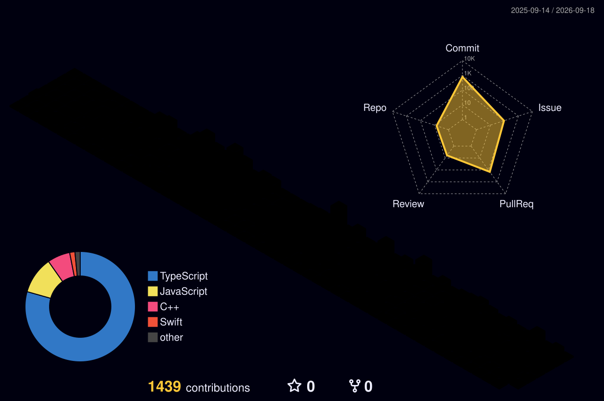

  

### 서버부터 화면까지, 사용자에게 닿는 흐름 전체를 만듭니다.

 

## 👋 About Me

- 🧩 **백엔드와 프론트엔드를 모두 책임져 본 개발자입니다.** [채택](https://checktask.kr)에서는 5인 백엔드 팀의 **팀장**으로 아키텍처와 알림 시스템을 설계했고, [투명지](https://tomyongji.com)·Deokive에서는 **팀 내 프론트엔드 최다 기여자**로 화면을 만들었습니다.
- 🚀 **만든 걸 실제로 운영합니다.** 투명지는 웹·iOS로 실서비스 중이고, 채택은 3차 릴리즈까지 배포했습니다.
- 🔍 **"왜 안 되는가"를 구조로 해결합니다.** UTC/KST 9시간 어긋남, 크론 중복 발송, 쿼리 캐시 stale — 증상을 덮지 않고 원인 지점을 고치는 걸 좋아합니다.
- 🎓 명지대학교 · 2026 상반기 캡스톤디자인으로 실시간 주식 시세 + AI 뉴스 분석 백엔드를 만들었습니다.

 

## 🛠️ Tech Stacks

**Back-End**

      

**Front-End**

      

**Infra & Tools**

    

 

## 📂 Projects

| Project | Description | Period | Highlight |
| --- | --- | --- | --- |
| [채택](https://checktask.kr) | 대학생 과제 관리 서비스 | `2025.12 ~ 2026.08` | **Back-End 팀장**(5인), 커밋 291건 · FCM 마감 알림 파이프라인 · checktask.kr 운영 |
| [투명지](https://tomyongji.com) | 학생회비 투명 공개 플랫폼 | `2026.01 ~ 현재` | **FE 최다 기여** 172건 · 어드민 전체 구현 · 웹 + iOS 실서비스 |
| [Deokive](https://github.com/Deokive/FE) | 덕질 아카이브 웹 서비스 | `2025.10 ~ 2026.02` | **FE 최다 기여** 197건 · 소셜 로그인, 아카이브 CRUD · 연합동아리 DEPth |
| [Jumoney](https://github.com/MJU-Capstone-Design-1/Jumoney_Node_BE) | 실시간 시세 · AI 뉴스 분석 백엔드 | `2026.03 ~ 2026.06` | 명지대 캡스톤 · KIS WebSocket → Redis · Gemini 뉴스 분석 · Docker/EC2 |

Repos · [채택 FE](https://github.com/check-task/frontend) · [채택 Mobile](https://github.com/check-task/mobile-frontend) · [투명지 FE](https://github.com/ToMyongJi/ToMyongJi-front-TS)

 

## 🏅 Stats

비공개 레포 기여를 포함한 수치입니다.

 

## 📮 Contact

